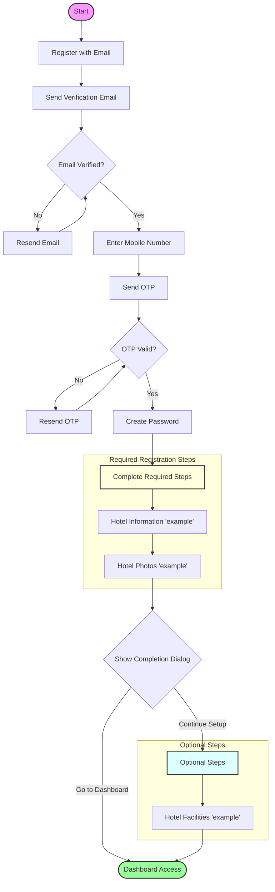

# March 2025 Project Progress Report 📊

## Overview 🎯

During the first week of March, significant progress has been made in implementing a robust registration system with enhanced security features and an improved user experience. Key achievements include the completion of email verification, mobile verification, and a sophisticated multi-step registration process.

## Authentication & Registration Flow 🔄

## Progress Breakdown by Area

### 🔐 Authentication & Registration System

#### Email Verification Flow

- Implemented complete email verification system
- Created verification link handling
- Added automatic verification status tracking
- Integrated with `/authentication/VerifyVendorEmail` endpoint

#### Mobile Verification System

- Developed international phone input component with:
  - Country code selection
  - Real-time validation
  - React Hook Form integration
- Implemented OTP verification service
- Created mobile number validation system
- Added secure password creation flow

#### Registration Process Enhancement

- Developed two-step registration form
- Implemented registration state persistence
- Created dynamic step management system
- Added route protection for registration process

### 🎨 UI/UX Improvements

#### Progress Tracking

- Implemented animated step indicators
- Added dark mode compatible progress bars
- Created visual completion status indicators

#### User Interface Components

- Developed registration banner for setup notifications
- Implemented sidebar progress indicators
- Created completion dialog for registration process
- Added mobile-responsive design elements

### 🏗️ Architecture & Technical Implementation

#### State Management

- Implemented RegistrationContext for centralized state handling
- Added progress tracking with persistence
- Created completion status tracking system

#### Route Management

- Restructured registration paths for better organization
- Moved registration steps from `/dashboard/setup` to `/auth/setup`
- Created dedicated settings page at `/dashboard/settings`
- Implemented comprehensive route protection system

### 🔧 System Optimization

#### Context Optimization

- Removed duplicate RegistrationProvider instances
- Consolidated registration steps management
- Optimized state management for better performance

#### Security Enhancements

- Implemented token-based authentication
- Added email verification requirements
- Created secure mobile verification with OTP
- Developed protected routes system

## 🎯 Key Achievements

1. Completed end-to-end registration flow implementation
2. Enhanced security with multi-factor verification
3. Improved user experience with animated progress indicators
4. Optimized state management and context usage
5. Implemented comprehensive route protection
