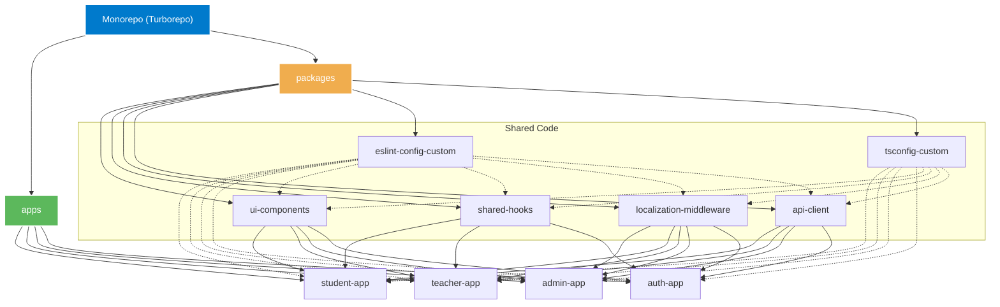
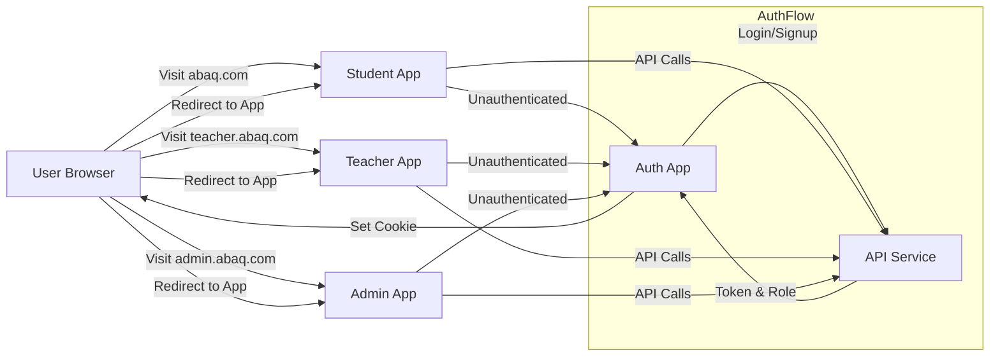
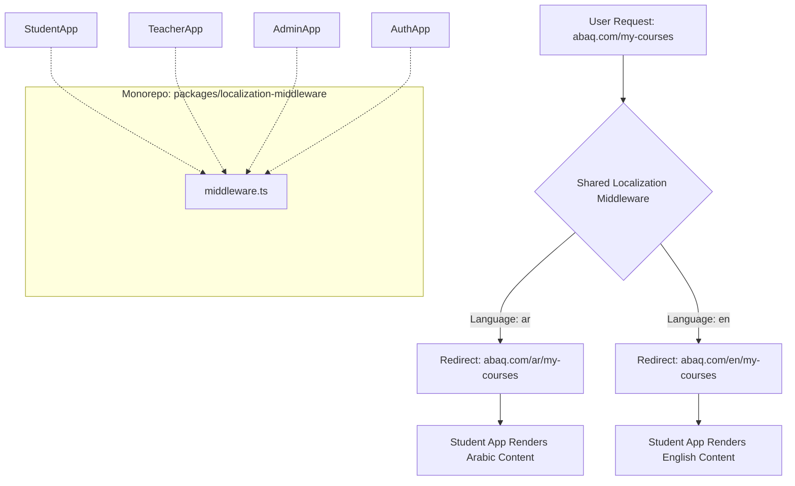

# 🚀 Project Abaq: Technical Architecture Rationale

## 🎯 Introduction: Building a Future-Proof LMS

This document outlines the key technical decisions made for Project Abaq, our Learning Management System. The choices of **React with Next.js**, a **Monorepo architecture powered by Turborepo**, and a **multi-app structure** were made strategically to ensure scalability, maintainability, developer efficiency, and a superior user experience.

Our goal is to build a robust platform that caters effectively to **students, teachers, and administrators**, today and in the future.

---

## 💡 Core Technology: React & Next.js - A Powerful Duo

### Why React?

- **Component-Based Architecture:**  
  Reusable UI components (buttons, forms, course cards) accelerate development and ensure UI consistency.

- **Rich Ecosystem & Community:**  
  Fast problem-solving, cutting-edge libraries, and availability of skilled developers.

- **Virtual DOM for Performance:**  
  Efficient updates = fast rendering.

- **Strong Industry Adoption:**  
  Proven stability and future support.

### Why Next.js?

- **Versatile Rendering Options:**  
  SSR for SEO, SSG for fast loading, CSR for interactive dashboards.

- **Optimized Performance:**  
  Code splitting, image optimization, and prefetching.

- **Enhanced Developer Experience (DX):**  
  TypeScript, file-system routing, fast refresh.

- **SEO Friendliness:**  
  Crucial for discoverability.

- **API Routes:**  
  Backend-for-Frontend (BFF) pattern support.

**Key Takeaway:** React provides the UI building blocks, Next.js brings the structure, performance, and full-stack capability.

---

## 🏗️ Architectural Strategy: Monorepo & Multi-App Structure

### Why a Monorepo (with Turborepo)?

- **Efficient Code Sharing:**  
  UI components, hooks, and logic shared across apps.

- **Streamlined Development & Collaboration:**  
  Atomic PRs, better refactoring.

- **Optimized Build & CI/CD Pipelines:**  
  Intelligent dependency tracking and remote caching.

- **Simplified Dependency Management:**  
  Single-point version management.

### Monorepo Structure

### Why Separate Applications?

- **Clear Separation of Concerns (SoC):**  
  Each app focuses on one role.

- **Independent Deployments & Scalability:**  
  Update and scale apps individually.

- **Tailored User Experiences (UX):**  
  Custom UI for students, teachers, and admins.

- **Enhanced Security Boundaries:**  
  Reduced attack surface.

- **Optimized Team Workflows:**  
  Different teams can manage different apps.

### Application Interaction & Authentication Flow

---

## ✨ Feature Highlight: Seamless Localization (ar/en)

### Shared Middleware Package

- **Functionality:**  
  - Detects user's language (browser/cookie/manual).  
  - Redirects non-localized URLs to `/ar/` or `/en/`.  
  - Supports Arabic & English.

- **Benefits:**  
  - Centralized logic.  
  - Consistent UX.  
  - Easy rollout across apps.

### Localization Flow

---

## 🏆 Overall Benefits & Synergy

- **High Performance:** Fast, optimized load times.
- **Scalability:** Apps and teams can grow independently.
- **Maintainability:** Clean boundaries, reusable packages.
- **Developer Velocity:** Fast dev cycles with shared logic.
- **Robustness:** Reduced risk via separation.
- **Future-Ready:** Flexible to expand and innovate.

---

## ✅ Conclusion

The technical decisions for Project Abaq were made with clarity and foresight. The combination of **React, Next.js, Turborepo**, and **role-based apps** ensures we're building a **fast, scalable, maintainable**, and **future-proof LMS**.
